# RucStore 项目实现文档
> 尽管项目简单，但涉及的工具使用仍有门槛，教程难免有所疏漏。
> 
> 希望你们可以多多查阅**官方文档**，借助多方工具搜集相关信息，尽其所能理解代码。

- [如何运行和查看本项目的效果](#如何运行和查看本项目的效果)
- [如何学习和理解本项目](#如何学习和理解本项目)
  - [前端框架](#前端框架)
  - [layout 实现](#layout-实现)
    - [\<head\>](#head)
    - [\<body\>](#body)
    - [小结](#小结)
  - [注册和登录](#注册和登录)
    - [User table](#user-table)
    - [注册](#注册)
    - [登录](#登录)
    - [登出](#登出)
  - [个人信息管理](#个人信息管理)
    - [整体逻辑](#整体逻辑)
    - [用户名、邮箱和密码管理](#用户名邮箱和密码管理)
    - [收货和发货地址管理](#收货和发货地址管理)
  - [商品管理](#商品管理)
    - [Product table](#product-table)
    - [添加商品](#添加商品)
    - [修改商品](#修改商品)
    - [删除商品](#删除商品)
  - [订单管理](#订单管理)
    - [Order table](#order-table)
    - [购物车](#购物车)
    - [订单](#订单)
- [如何扩展实现本项目](#如何扩展实现本项目)

## 如何运行和查看本项目的效果
* 安装 python3.x 环境
* 按照 [配置文档](RucStore%20配置文档.md) 配置 MySQL 和 Flask

在 mysql 执行 `ruc_store.sql`，可以通过 [source](https://www.runoob.com/mysql/mysql-database-import.html) 命令导入数据。

修改 `src/__init__.py` 文件中 `app.config["SQLALCHEMY_DATABASE_URI"]`，username、password、database 分别对应 MySQL 的用户名、密码和项目所使用的数据库（如果是通过 `ruc_store.sql` 生成的数据库，该项为 **ruc_store**），同时参考 [secret key](https://stackoverflow.com/questions/34902378/where-do-i-get-secret-key-for-flask) 随机生成 `app.config['SECRET_KEY']`

最后在 `src` 目录下执行命令 `python run.py` 运行项目，默认情况下使用 **5000** 端口访问

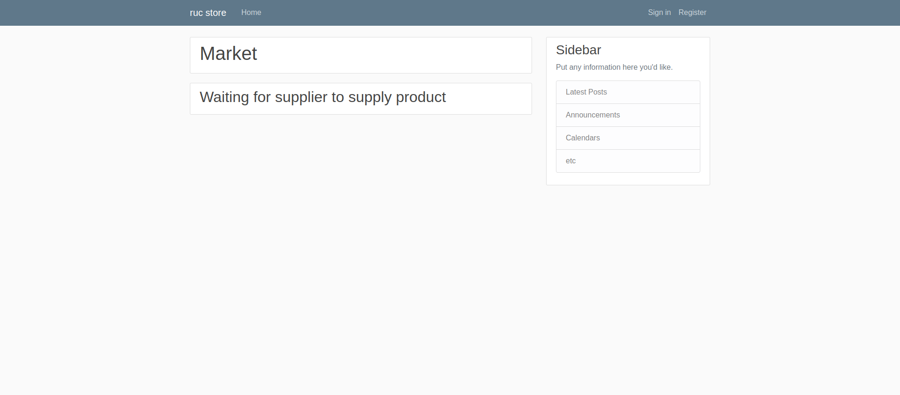

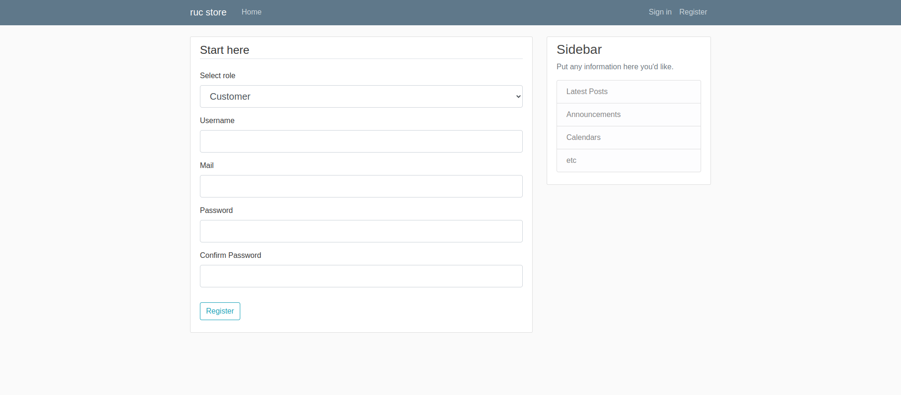

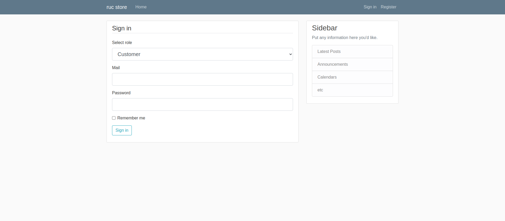

## 如何学习和理解本项目
* 通过 [Flask 文档](Flask%20简单教程.md) 学习并运行了 _demo
* 必须了解 **flask_login**、**flask_sqlalchemy** 、**flask_wtf** 的使用
  - [flask_login 教程](https://flask-login-cn.readthedocs.io/zh/latest/)
  - [flask_sqlalchemy 教程](https://flask-sqlalchemy.palletsprojects.com/en/3.0.x/quickstart/)
  - [flask_wtf 教程](https://flask-wtf.readthedocs.io/en/1.2.x/quickstart/)
* 通过网上资料加深了对 Python、HTML、CSS、Flask 的理解
  - [Python 教程](https://www.liaoxuefeng.com/wiki/1016959663602400)
  - [HTML 教程](https://www.runoob.com/html/html-tutorial.html)
  - [CSS 教程](https://www.runoob.com/css/css-tutorial.html)
  - [Flask 教程](https://dormousehole.readthedocs.io/en/latest/)

### 前端框架
考虑到同学们的前端知识，本项目实现并不对 HTML 和 CSS 做出过多要求，但是希望大家能借助互联网尝试调整甚至美化界面。

我们使用 Bootstrap 前端框架来大大简化同学们的操作难度。通过 [layout.html](../src/store/templates/layout.html) 文件的第 9 行，我们引入 Bootstrap CSS 文件
```html
<link rel="stylesheet" href="https://maxcdn.bootstrapcdn.com/bootstrap/4.0.0/css/bootstrap.min.css" integrity="sha384-Gn5384xqQ1aoWXA+058RXPxPg6fy4IWvTNh0E263XmFcJlSAwiGgFAW/dAiS6JXm" crossorigin="anonymous">
```

Bootstrap 自带的大部分组件需要原来 JavaScript 才能起作用。具体来说，这些组件依赖 jQuery、Popper 以及他们自己开发的 JavaScript 插件。通过 [layout.html](../src/store/templates/layout.html) 文件的第 80 - 82 行，引入我们需要的 JS 文件

```html
<script src="https://code.jquery.com/jquery-3.2.1.slim.min.js" integrity="sha384-KJ3o2DKtIkvYIK3UENzmM7KCkRr/rE9/Qpg6aAZGJwFDMVNA/GpGFF93hXpG5KkN" crossorigin="anonymous"></script>
<script src="https://cdnjs.cloudflare.com/ajax/libs/popper.js/1.12.9/umd/popper.min.js" integrity="sha384-ApNbgh9B+Y1QKtv3Rn7W3mgPxhU9K/ScQsAP7hUibX39j7fakFPskvXusvfa0b4Q" crossorigin="anonymous"></script>
<script src="https://maxcdn.bootstrapcdn.com/bootstrap/4.0.0/js/bootstrap.min.js" integrity="sha384-JZR6Spejh4U02d8jOt6vLEHfe/JQGiRRSQQxSfFWpi1MquVdAyjUar5+76PVCmYl" crossorigin="anonymous"></script>
```

对于 Bootstrap 的使用，例如 [Alert 组件](https://v4.bootcss.com/docs/components/alerts/)，它能够展示任意长度的文本以及一个可选的关闭按钮。为了展示合适的样式，必须从下列 8 个类（例如 .alert-success）中选择一个合适的并使用。
```html
<div class="alert alert-primary" role="alert">
  A simple primary alert—check it out!
</div>
<div class="alert alert-secondary" role="alert">
  A simple secondary alert—check it out!
</div>
<div class="alert alert-success" role="alert">
  A simple success alert—check it out!
</div>
<div class="alert alert-danger" role="alert">
  A simple danger alert—check it out!
</div>
<div class="alert alert-warning" role="alert">
  A simple warning alert—check it out!
</div>
<div class="alert alert-info" role="alert">
  A simple info alert—check it out!
</div>
<div class="alert alert-light" role="alert">
  A simple light alert—check it out!
</div>
<div class="alert alert-dark" role="alert">
  A simple dark alert—check it out!
</div>
```

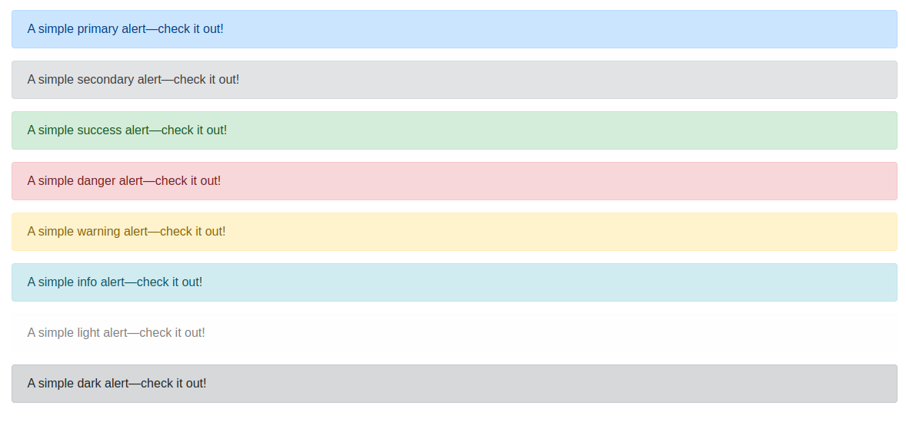

可以看到，我们几乎摆脱了繁琐的 CSS 样式调整，只需要简单地引入 `class=alert alert-xxx` 就能够得到美观的页面。对于 Boostrap 的详细使用大家可以参考 [Bootstrap CSS](https://v4.bootcss.com/docs/getting-started/introduction/)。另外，项目中也增加了 [main.css](../src/store/static/main.css) 帮助同学们更好地自定义调成界面。

### layout 实现
正如在 [Flask 文档](Flask%20简单教程.md) 中提到的 Flask 模板继承，我们希望能够尽可能的提高代码复用率，不希望每个页面都重复引入 css 文件和布局代码，所以我们首先实现 [layout.html](../src/store/templates/layout.html) 文件，后面我们实现的所有 HTML 文件都继承或者间接继承自该文件。

#### \<head\>
通过 \<meta\> charset 规定 HTML 文档的字符编码
```html
<meta charset="utf-8">
```

通过 \<meta\> viewport 以便在移动设备上正确显示 (详情可参考 [meta viewport tag](https://stackoverflow.com/questions/51975238/using-html-meta-viewport-tag-with-bootstrap))
```html
<meta name="viewport" content="width=device-width, initial-scale=1, shrink-to-fit=no">
```

同时我们在 \<head\> 部分引入 [bootstrap css](#前端框架)

#### \<body\>
> 这部分会涉及到后面的一些设计，所以暂时不要求完全搞懂代码，只需要**理解代码逻辑**。
> 等读完后续文档，可以再回头重新理解这部分内容。

在网页设计的时候，我们不妨参考 “**div 梭哈**” 的粗暴方式（注： 这只是盒子布局的例子用法，不能代表盒子布局。而且这种布局已是十年前的用法，现在多采用 HTML5 + CSS3 的方式）


简单举例来说，我们在实现上述页面（最终实现的未登录主页面）的时候，可以将其划分为两部分，分别是**头部 header** 和**主体 main**

在 header 部分 ( [layout.html](../src/store/templates/layout.html)) 的第 18 - 48 行），我们实现简单的 ruc store 标识，Home、Sign in、Register 导航等。如果 Customer 用户登录，需要将 Sign in、Register 导航切换成 Cart、Settings、Logout 导航；如果 Supplier 用户登录，需要将 Sign in、Register 导航切换成 Settings、Logout 导航。

在 main 部分 ( [layout.html](../src/store/templates/layout.html)) 的第 49 - 77 行），我们再次将页面划分为两部分。左边(第 51 - 62 行) 是我们使用的主体，在后续实现中，我们通过模板继承动态实现该部分。右边(第 63 - 75 行) 是用作装饰的侧边栏（**同学可以自己添加功能**）

在 main 部分左边实现中，我们用到了 **Flask 消息闪现**，大家可以通过 [Flask 消息闪现示例](https://dormousehole.readthedocs.io/en/latest/patterns/flashing.html) 来快速理解。

```html

    
        
            <div class="alert alert-{{ category }}">
                {{ message }}
            </div>
        
    

```

#### 小结
在 layout 实现中，大家重点需要关注的有两点
* 根据登录状态和登录用户来切换 header 内容，请结合后续内容理解
* main 主体部分继承，其实就一句话 ``

### 注册和登录

* [routes.py](../src/store/routes.py)
* [forms.py](../src/store/forms.py)
* [models.py](../src/store/models.py)
* [layout.html](../src/store/templates/layout.html)
* [login.html](../src/store/templates/login.html)
* [register.html](../src/store/templates/register.html)
* [home.html](../src/store/templates/home.html)

#### User table
在设计之前，我们首先需要明确自己需要**实现哪些功能**？实现这些功能我们**需要哪些依赖**？针对这个项目的注册登录，我们可能需要实现如下功能：
* Customer 注册登录
* Supplier 注册登录
* **用户 session 的管理**

Customer 和 Supplier 的注册登录可以分别使用 Customer、Supplier 两个 table 来记录他们的 username、password 等信息，而用户 session 的管理，我们需要借助 [Flask_login](https://flask-login-cn.readthedocs.io/zh/latest/) 并定义 User 类来管理

在 [models.py](../src/store/models.py) 文件中我们定义 Customer、Supplier 类。同时我们将 **email 列的 unique 属性设置为 true**，将其作为 Customer(Supplier) 的一个唯一性标识，即不允许 Customer(Supplier) 用户的 email 重复。
```python
class Customer(db.Model,UserMixin):
    __tablename__ = "Customer"
    id = db.Column(db.Integer,primary_key=True)
    username = db.Column(db.String(20),unique=False,nullable=False)
    email = db.Column(db.String(120),unique=True,nullable=False)
    password = db.Column(db.String(60),nullable=False)
    consignee = db.Column(db.String(20),nullable=False,default="null")
    address = db.Column(db.String(40),nullable=False,default="null")
    telephone = db.Column(db.String(20),nullable=False,default="null")


class Supplier(db.Model,UserMixin):
    __tablename__ = "Supplier"
    id = db.Column(db.Integer,primary_key=True)
    username = db.Column(db.String(20),unique=False,nullable=False)
    email = db.Column(db.String(120),unique=True,nullable=False)
    password = db.Column(db.String(60),nullable=False)
    shipper = db.Column(db.String(40),nullable=False,default="null")
    address = db.Column(db.String(40),nullable=False,default="null")
    telephone = db.Column(db.String(20),nullable=False,default="null")
```

另外，我们实例化 User 类，主键 id 作为 load_user 函数的返回值。通过 table_name 和 table_id 将其与 Customer、Supplier 表联系在一起，即通过 table_name 得到该条目用户属于 Customer 还是 Supplier，通过 table_id 得到该条目用户在 Customer(Supplier) 的具体条目。
```python
@login_manage.user_loader
def load_user(user_id):
    return User.query.get(int(user_id))


class User(db.Model,UserMixin):
    __tablename__="User"
    id = db.Column(db.Integer, primary_key=True)
    username = db.Column(db.String(20), unique=False, nullable=False,default="私密")
    email = db.Column(db.String(120), unique=True, nullable=False)
    table_name = db.Column(db.String(20), unique=False, nullable=False)
    table_id = db.Column(db.Integer,nullable=False)
```

#### 注册

在 [route.py](../src/store/routes.py) 文件中，我们访问 **http://localhost:5000** 或者 **http://localhost:5000/home** 即可访问到网站主页。
```python
@app.route('/')
@app.route("/home")
def home():
    products = Product.query.all()
    return render_template("home.html", products=products)
```

这里我们暂不关注 home.html 文件的实现，而是查看其继承的 [layout.html](../src/store/templates/layout.html) 文件。我们需要设置在未登录界面时**导航栏的 Register 导航跳转**(第 42 行)，这里 url_for('register') 即对应 [route.py](../src/store/routes.py) 中 register 函数的实现
```html
<a class="nav-item nav-link" href="{{ url_for('register') }}">Register</a>
```

在 [forms.py](../src/store/forms.py) 文件中，我们定义注册界面的 form
```python
class RegistrationForm(FlaskForm):
    role=SelectField("Select role", coerce=str, choices=[("1","Customer"), ("2","Supplier")])
    username = StringField('Username', validators=[DataRequired(), Length(min=2, max=20)])
    email = StringField('Mail', validators=[DataRequired(), Email()])
    password = PasswordField('Password', validators=[DataRequired(), Length(min=6, max=20)])
    confirm_password = PasswordField('Confirm Password', validators=[DataRequired(), EqualTo('password')])
    submit = SubmitField('Register')
```

由于我们将 email 作为一个唯一性标识，所以在 RegistrationForm 类中增加邮箱验证函数 validate_email，判断他所在用户表内是否已经存在用户使用了该邮箱
```python
    def validate_email(self, email):
        if self.role.data == "1":
            table = Customer
        elif self.role.data == "2":
            table = Supplier
        if table.query.filter_by(email=email.data).first():
            raise ValidationError("Duplicate email")
```

在 [register.html](../src/store/templates/register.html) 文件中我们实现其前端，以 RegistrationForm 中的 email 为例(对应 registre.html 第 34 - 46 行)，因为 validators=[DataRequired(), Email()]，所以会判断 email 是否为空且是否符合邮箱格式。同时因为我们定义了 validata_email 函数，所以还会判断该邮箱是否被其他用户使用了。如果不符合要求，form.role.errors 则不为空，我们会将 form.role 增加 [class=is-invalid](https://bootstrapshuffle.com/cn/classes/forms/is-invalid)，同时显示 error 
```html
<div class="form-group">
    {{ form.role.label(class="form-control-label") }}
    
        {{ form.role(class="form-control form-control-lg is-invalid") }}
         <div class="invalid-feedback">
            
                <span>{{ error }}</span>
            
        </div>
    
        {{ form.role(class="form-control form-control-lg") }}
    
</div>
```


最后我们在 [route.py](../src/store/routes.py) 定义视图函数 register。如果我们提交表单的数据满足 validators 且没有抛出异常（例如 validate_email 在邮箱已使用时会抛出异常），则 form.validate_on_submit() == True，然后我们根据表单数据插入 Customer(Supplier) 和 User 表合适的条目。这里，我们用到了 bcrypt 对 password 进行加密。
```python
@app.route("/register",methods=["GET", 'POST'])
def register():
    form = RegistrationForm()
    if form.validate_on_submit():
        if form.role.data == "1":
            role = Customer()
            table_name = "Customer"
            table = Customer
        elif form.role.data == "2":
            role = Supplier()
            table_name = "Supplier"
            table = Supplier
        hashed_password = bcrypt.generate_password_hash(password=form.password.data).decode("utf-8")
        role.username = form.username.data
        role.email = form.email.data
        role.password = hashed_password
        db.session.add(role)
        db.session.commit()
        user = User()
        user.table_name = table_name
        user.table_id = table.query.filter_by(email=form.email.data).first().id
        user.username=form.username.data
        user.email=form.email.data
        db.session.add(user)
        db.session.commit()
        flash('Your account was created successfully', 'success')
        return redirect(url_for('login'))
    return render_template('register.html', title='Register', form=form)
```

#### 登录

在 [layout.html](../src/store/templates/layout.html) 文件,我们需要设置在未登录界面时**导航栏的 Sign in 导航跳转**(第 41 行)，这里 url_for('login') 即对应 [route.py](../src/store/routes.py) 中 login 函数的实现
```html
<a class="nav-item nav-link" href="{{ url_for("login") }}">Sign in</a>
```

在 [forms.py](../src/store/forms.py) 文件中，我们定义登录界面的 form，在这里我们并不定义相关 validate 函数进行登录验证，而是在表单提交之后交给视图函数 login
```python
class LoginForm(FlaskForm):
    role = SelectField("Select role",coerce=str,choices=[("1","Customer"),("2","Supplier")])
    email = StringField('Mail',validators=[DataRequired(), Email()])
    password = PasswordField('Password',validators=[DataRequired()])
    remember = BooleanField("Remember me")
    submit = SubmitField('Sign in')
```

在 [login.html](../src/store/templates/login.html) 文件中我们实现其前端


最后我们在 [route.py](../src/store/routes.py) 定义视图函数 login。如果我们提交表单的数据满足 validators 且没有抛出异常，则 form.validate_on_submit() == True，然后我们根据表单数据选择对应用户的 table 查询用户和密码是否正确。因为我们将 email 作为了一个唯一性标识，所以我们不妨选择 email 来进行查询，即 `table.query.filter_by(email=form.email.data).first()`，非空则说明用户存在。同时，对比用户密码是否正确 `bcrypt.check_password_hash(user.password, form.password.data)`。如果都没问题，我们使用 login_user 函数登录。登录不成功则使用 flash 消息闪现

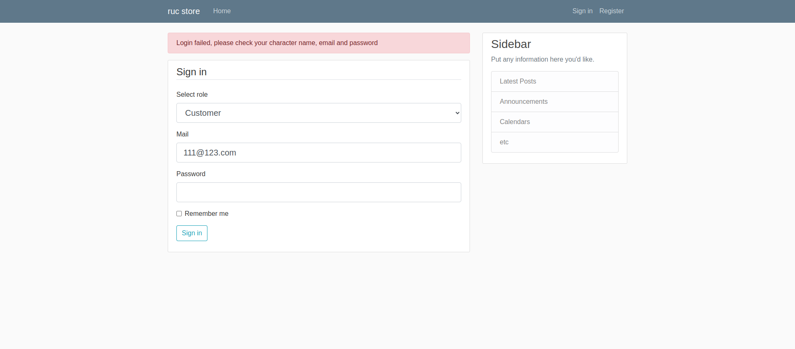

Customer 登录后，header 将增加 Cart、Settings、Logout 导航

```html
<!--  见 layout.html 第 32 - 35 行 -->

    <a class="nav-item nav-link" href={{ url_for("shopping_cart") }}>Cart</a>
    <a class="nav-item nav-link" href="{{ url_for("customer_account",username=current_user.username) }}">Settings</a>
    <a class="nav-item nav-link" href="{{ url_for('logout') }}">Logout</a>
```
Supplier 登录后，header 将增加 Settings、Logout 导航

```html
<!--  见 layout.html 第 36 - 38 行 -->

    <a class="nav-item nav-link" href="{{ url_for("supplier_account",username=current_user.username) }}">Settings</a>
    <a class="nav-item nav-link" href="{{ url_for('logout') }}">Logout</a>
```

#### 登出
在用户登录后，可以看到 header 导航栏有 log out 选项

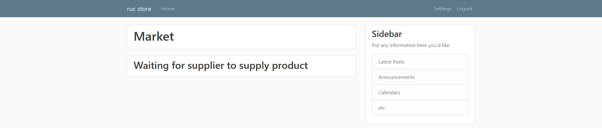

我们在视图函数 logout 中实现，使用 logout_user() 登出即可
```python
@app.route("/logout")
def logout():
    logout_user()
    return redirect(url_for('home'))
```

### 个人信息管理
* [route.py](../src/store/routes.py)
* [form.py](../src/store/forms.py)
* [layout.html](../src/store/templates/layout.html)
* [home.html](../src/store/templates/home.html)
* [accout_laytou.html](../src/store/templates/account_layout.html)
* [customer_accout.html](../src/store/templates/customer_account.html)
* [supplier_accout.html](../src/store/templates/supplier_account.html)
* [update_consignee.html](../src/store/templates/update_consignee.html)
* [update_shipper.html](../src/store/templates/update_shipper.html)
* [update_password.html](../src/store/templates/update_password.html)
* [update_info.html](../src/store/templates/update_info.html)

#### 整体逻辑
由于这部分涉及的文件较多，所以先陈述一下该部分整体逻辑。

因为本项目设计目的主要还是用于商品交易，收获地址和发货地址是不可缺少的。所以我们在用户登录后，进行其他操作前都先验证用户的收获(发货)地址是否完善。只有该信息完善才能继续操作。实现思路就是，当 Supplier(Customer) 登录后，点击 header 导航栏的  (Cart)、Settings 都会验证收获地址是否完善（即是否为**字符串** "null"），如果没有完善则跳转到收货(发货)地址管理界面。

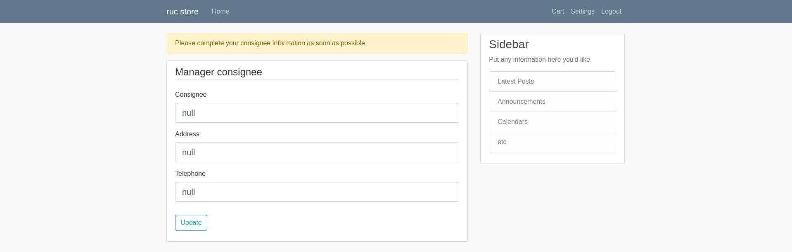

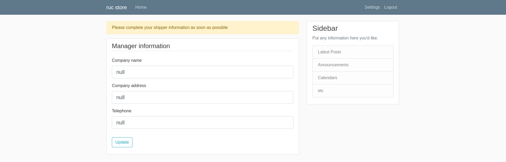

当 Customer(Supplier) 登录并完善收货(发货)信息后，点击 header 导航部分的 Settings 即可进入到用户的信息管理、订单管理、收货(发货)地址管理等

```html
<!-- 见 customer_accout.html -->


    <a href={{ url_for("update_info") }}>Manage profile</a><br><br>
    <a href={{ url_for("customer_order_manage") }}>Manage orders</a><br><br>
    <a href={{ url_for("customer_consignee_manage") }}>Manage consignee</a><br><br>

```

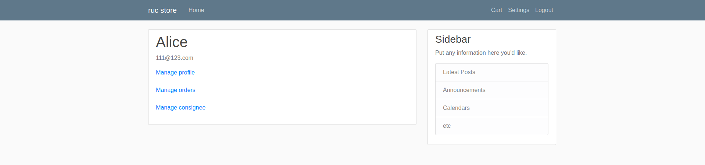

```html
<!-- 见 supplier_accout.html -->


    <a href={{ url_for("update_info") }}>Manager profile</a><br><br>
    <a href={{ url_for("supplier_product_manage") }}>Manager products</a><br><br>
    <a href={{ url_for("supplier_order_manage") }}>Manager orders</a><br><br>
    <a href={{ url_for("supplier_shipper_manage") }}>Manager shipper</a><br><br>

```

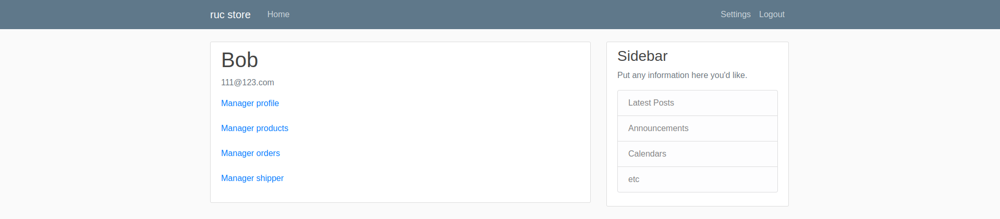

这部分我们重点关注 Manager Profile 和 Manage cosignee(shipper)，点击 Manager Profile 我们跳转到修改用户名、邮箱和密码的界面，点击 Manage consignee(shipper) 我们跳转到修改收货(发货)地址的界面。

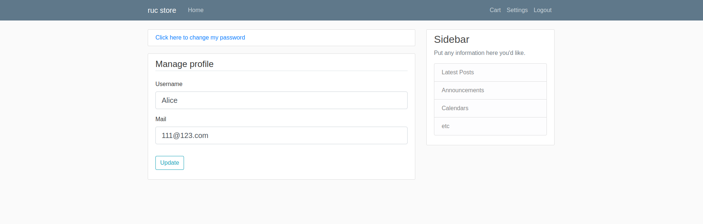

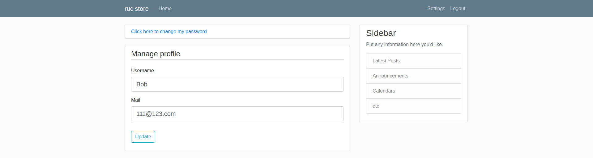

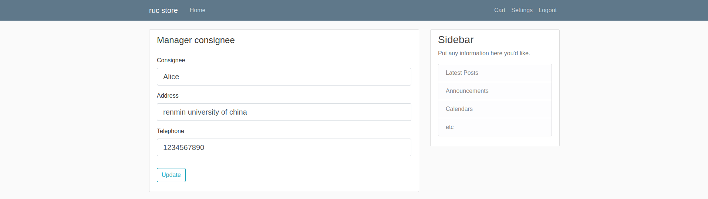

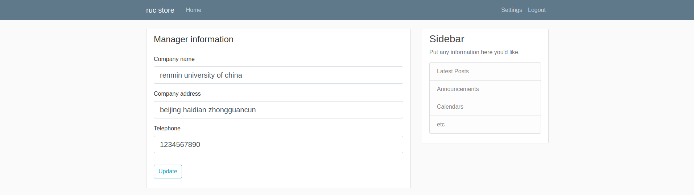

#### 用户名、邮箱和密码管理

由于 Customer 和 Supplier 都具有 username、email 和 password 属性，所以不妨统一处理。

username 和 email 既存在了 Customer(Supplier)，也存在了 User，但幸运的是并不涉及表连接等操作，实质还是两个单表操作。

在 [form.py](../src/store/forms.py) 中，我们定义 username 和 email 更新的 form

```python
class UpdateInfo(FlaskForm):
    username = StringField('Username',validators=[DataRequired(), Length(min=2, max=20)])
    email = StringField('Mail',validators=[DataRequired(), Email()])
    submit = SubmitField('Update')
```

同样地，因为我们将 email 作为了一个唯一性标识，所以还需要验证修改后的 email 是否满足需求

```python
    def validate_email(self, email):
        if current_user.table_name == "Customer":
            table = Customer
        elif current_user.table_name == "Supplier":
            table = Supplier
        user = table.query.filter_by(email=email.data).first()
        if user and user.username !=current_user.username:
            raise ValidationError("Duplicate email")
```

在 [update_info.html](../src/store/templates/update_info.html) 文件中我们实现其前端


最后我们在 [route.py](../src/store/routes.py) 定义视图函数 update_info。表单成功提交并通过验证后，我们进行更新操作，只不过需要对 Cutomer(Supplier) 和 User 各做一次。如果 methoad == "GET"，对 form.xxx.data 赋值，这样前端能够显示我们修改前的各项值
```python
@app.route("/update/info",methods=["GET","POST"])
@login_required
def update_info():
    if current_user.table_name == "Customer":
        table = Customer
    elif current_user.table_name == "Supplier":
        table = Supplier
    form = UpdateInfo()
    role = table.query.filter_by(id=current_user.table_id).first()
    if form.validate_on_submit():
        role.username = form.username.data
        role.email = form.email.data
        db.session.add(role)
        db.session.commit()
        user = User.query.filter_by(id=current_user.id).first()
        user.username = form.username.data
        user.email = form.email.data
        db.session.add(user)
        db.session.commit()
        flash('Profile updated successfully', 'success')
        return redirect(url_for("home"))
    if request.method == "GET":
        form.username.data = role.username
        form.email.data = role.email
    return render_template("update_info.html", form=form)
```

password 我们并不和 username 和 email 在同一个界面更新，这也方便同学们增加一些功能（例如：**修改密码前的安全验证**）在 Manage Profile 界面，点击 `Click here to change my password` 按钮即可进入到修改密码界面。

同样地，在 [form.py](../src/store/forms.py) 中，我们定义 password 更新的 form

```python
class UpdatePasswordForm(FlaskForm):
    password = PasswordField('Password', validators=[DataRequired(),Length(min=6, max=20)])
    confirm_password = PasswordField('Confirm Password',validators=[DataRequired(), EqualTo('password')])
    submit = SubmitField('Update')
```

在 [update_password.html](../src/store/templates/update_password.html) 文件中我们实现其前端

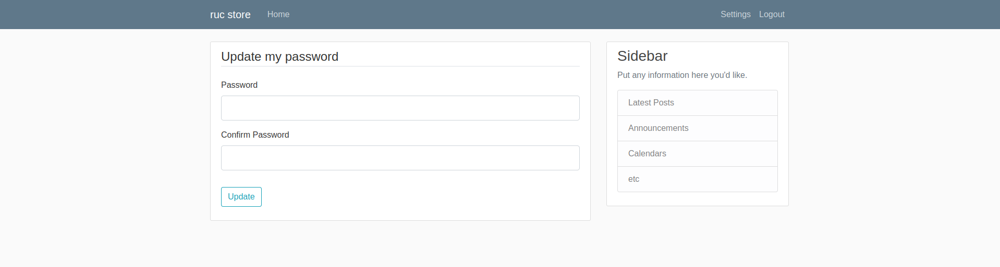

最后我们在 route.py 定义视图函数 customer_password. 

```python
@app.route("/update/password",methods=["GET","POST"])
@login_required
def update_password():
    if current_user.table_name == "Customer":
        table = Customer
    elif current_user.table_name == "Supplier":
        table = Supplier
    form = UpdatePasswordForm()
    role = table.query.filter_by(id=current_user.table_id).first()
    if form.validate_on_submit():
        hashed_password = bcrypt.generate_password_hash(password=form.password.data).decode("utf-8")
        role.password = hashed_password
        role.confirm_password = form.confirm_password.data
        db.session.add(role)
        db.session.commit()
        flash('Your password has been updated', 'success')
        return redirect(url_for("home"))
    return render_template("update_password.html", form=form)
```

#### 收货和发货地址管理

收货地址管理和发货地址管理几乎完全一样，这里以收货地址为例说明。

用户的收货地址存在 `Customer` 表中，所以收获地址管理只涉及 `Customer` 单表操作。

在 [form.py](../src/store/forms.py) 中，我们定义收获地址更新的 form
```python
class UpdateConsigneeForm(FlaskForm):
    consignee = StringField("Consignee",validators=[InputRequired(),Length(min=2,max=20)])
    address = StringField("Address",validators=[InputRequired(),Length(min=10,max=40)])
    telephone = StringField("Telephone",validators=[InputRequired(),Length(max=20,min=9)])
    submit = SubmitField("Update")
```

在 [update_consignee.html](../src/store/templates/update_consignee.html) 文件中我们实现其前端

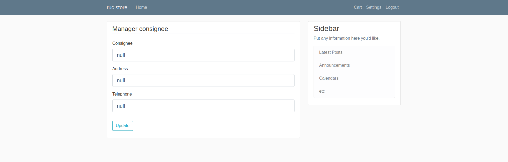

最后我们在 route.py 定义视图函数 customer_consignee_manage. 注意，当 methoads == "GET" 时，我们给 form.xxx.data 赋值，这样前端能够显示我们修改前的各项值（default 为**字符串** "null"） 

```python
@app.route("/customer/consignee", methods=["POST","GET"])
@login_required
def customer_consignee_manage():
    if current_user.table_name != "Customer":
        abort(403)
    address = Customer.query.filter_by(id=current_user.table_id).first()
    form = UpdateConsigneeForm()
    if form.validate_on_submit():
        address.consignee = form.consignee.data
        address.address = form.address.data
        address.telephone = form.telephone.data
        db.session.commit()
        flash("Shipping address updated successfully!","success")
    elif request.method =="GET":
        form.consignee.data = address.consignee
        form.address.data = address.address
        form.telephone.data = address.telephone
    return render_template("update_consignee.html",form=form)
```

> 至此，相信大家应当对构建 form，前端和视图函数的一套流程已经相当熟悉。

#### 信息完善验证
正如刚才所说，我们希望的逻辑是管理信息之前首先验证收货(发货)地址是否完善，所以我们需要判断：如果信息完善跳转到正常信息管理界面，如果信息不完善则跳转到收货(发货)地址管理界面。所以对于 [layout](../src/store/templates/layout.html)  文件用到的 shopping_cart、customer_account、supplier_accout 视图函数，都需要进行相关判断

```html

    <a class="nav-item nav-link" href={{ url_for("shopping_cart") }}>Cart</a>
    <a class="nav-item nav-link" href="{{ url_for("customer_account",username=current_user.username) }}">Settings</a>
    <a class="nav-item nav-link" href="{{ url_for('logout') }}">Logout</a>

    <a class="nav-item nav-link" href="{{ url_for("supplier_account",username=current_user.username) }}">Settings</a>
    <a class="nav-item nav-link" href="{{ url_for('logout') }}">Logout</a>

```

例如在 customer_account 视图函数中，我们验证 consignee、address或telephone的其中之一是否为默认初始字符串 "null"

```python
@app.route("/customer/<string:username>/account")
@login_required
def customer_account(username):
    if current_user.table_name != "Customer":
        abort(403)
    customer = Customer.query.filter_by(id=current_user.table_id).first()
    if customer.consignee == "null" or customer.address == "null" or customer.telephone == "null":
        flash("Please complete your consignee information as soon as possible","warning")
        return redirect(url_for("customer_consignee_manage"))
    return render_template("customer_account.html", username=username)

```

### 商品管理
* [route.py](../src/store/routes.py)
* [forms.py](../src/store/forms.py)
* [models.py](../src/store/models.py)
* [supplier_accout.html](../src/store/templates/supplier_account.html)
* [supplier_product_manage.html](../src/store/templates/supplier_product_manage.html)
* [supplier_new_product.html](../src/store/templates/supplier_new_product.html)
* [supplier_update_product.html](../src/store/templates/supplier_update_product.html)


#### Product table
Product 表在包含商品信息的同时，将 Supplier_id 作为外键

```python
class Product(db.Model):
    __tablename__="Product"
    id = db.Column(db.Integer, primary_key=True)
    name = db.Column(db.String(40),nullable=False,default="null")
    price = db.Column(db.Float,nullable=False,default=0.00)
    count = db.Column(db.Integer, nullable=False, default=0)
    Supplier_id = db.Column(db.Integer,db.ForeignKey("Supplier.id"),nullable=False)
```

#### 添加商品
Supplier 用户登录并完善发货地址后，点击 header 的 Settings，进入如下界面，`Manage products` 对应视图函数 `supplier_product_manage` ( [supplier_accout.html](../src/store/templates/supplier_account.html) 第 4 行)


```python
@app.route("/supplier/products")
@login_required
def supplier_product_manage():
    if current_user.table_name != "Supplier":
        abort(403)
    products = Product.query.all()
    return render_template("supplier_product_manage.html",products=products)
```

[supplier_product_manage.html](../src/store/templates/supplier_product_manage.html) 文件逻辑很简单，在接受到视图函数 supplier_product_manage 传递的 `products` 参数后，如果非空则列出所有 product。无论是否有 product 我们均增加添加商品 `supplier_new_product` 的跳转

```html


    <h1>Manage product</h1>
    
        
            <div class="content-section">
                <a >Product name: {{ product.name }}</a><br>
                <a >Product price: {{ product.price }}</a><br>
                <a >Product count: {{ product.count }}</a><br>
                <a>----------------------------------------------</a><br>
                <a href={{ url_for("supplier_update_product",id=product.id) }}>Update</a>
                &nbsp;&nbsp;&nbsp;&nbsp;
                <a href={{ url_for("supplier_delete_product",id=product.id) }}>Delete</a>
            </div>
        
        <div class="col-md-8">
            <a href={{ url_for("supplier_new_product") }}>Add new product</a>
        </div>
    
        <a href={{ url_for("supplier_new_product") }}>Waiting for you to supply product</a>
    

```

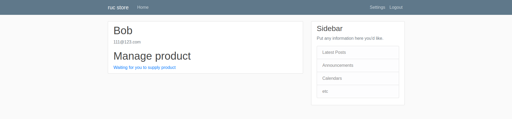

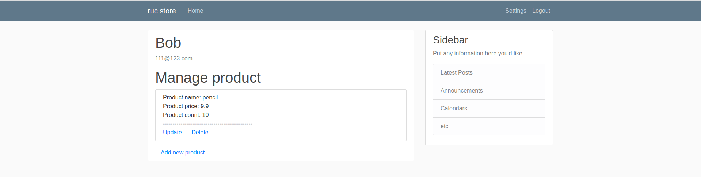

接下来依旧是通过构建 form，前端和视图函数三步来实现增加商品的功能。

在 [forms.py](../src/store/forms.py) 文件中，我们增加 ProductForm

```python
class ProductForm(FlaskForm):
    name = StringField('Product name',validators=[DataRequired(), Length(min=2, max=40)])
    price =FloatField("Product price", validators=[DataRequired()])
    count = IntegerField("Product count", validators=[DataRequired()])
    confirm = IntegerField("Confirm Product count",validators=[DataRequired(), EqualTo("count")])
    submit = SubmitField("Add")
```

在 [supplier_new_product.html](../src/store/templates/supplier_new_product.html) 文件中，我们实现前端

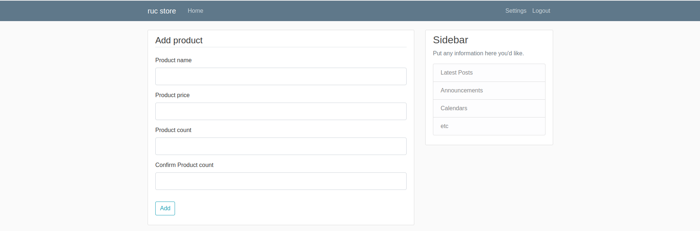

最后我们在 [route.py](../src/store/routes.py) 定义视图函数 supplier_new_product。商品信息通过提交的表单获取，而 supplier_id 通过 current_user.table_id 获取

```python
@app.route("/supplier/products/new", methods=["GET","POST"])
@login_required
def supplier_new_product():
    if current_user.table_name != "Supplier":
        abort(403)
    form = ProductForm()
    if form.validate_on_submit():
        product = Product(name=form.name.data,price=form.price.data,count=form.count.data,supplier_id=current_user.table_id)
        db.session.add(product)
        db.session.commit()
        flash("Your product was added successfully", "success")
        return redirect(url_for("supplier_product_manage"))
    return render_template("supplier_new_product.html",form=form)
```

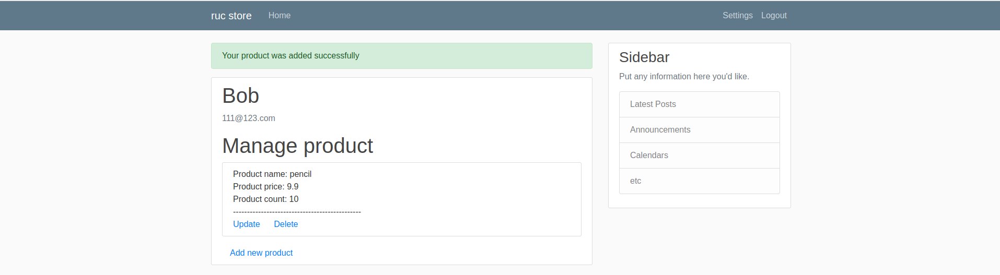

#### 修改商品
> **该功能和添加商品可以说一模一样，大家可以思考实现在不改变功能的基础上合并实现**

在 [forms.py](../src/store/forms.py) 文件中，我们增加 UpdateProductForm

```python
class UpdateProductForm(FlaskForm):
    name = StringField('Product name',validators=[InputRequired(), Length(min=2, max=40)])
    price = FloatField("Product price", validators=[InputRequired()])
    count = IntegerField("Product count", validators=[InputRequired()])
    confirm = IntegerField("Confirm Product count", validators=[InputRequired(), EqualTo("count")])
    submit = SubmitField("Update")
```

在 [supplier_update_product.html](../src/store/templates/supplier_update_product.html) 文件中，我们实现前端

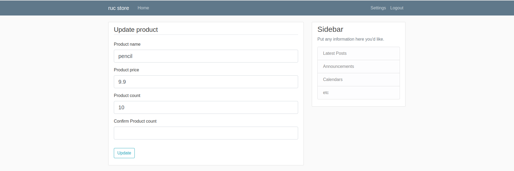

最后我们在 [route.py](../src/store/routes.py) 定义视图函数 supplier_update_product。函数参数 id 通过 [supplier_product_manage.html](../src/store/templates/supplier_product_manage.html) 第 11 行获取。如果 methoad == "GET"，对 form.xxx.data 赋值，这样前端能够显示我们修改前的各项值

```python
@app.route("/supplier/product/update/<int:id>",methods=["GET","POST"])
@login_required
def supplier_update_product(id):
    if current_user.table_name != "Supplier" or \
            Product.query.filter_by(id=id).first().supplier.id != current_user.table_id:
        abort(403)
    form = UpdateProductForm()
    if form.validate_on_submit():
        product = Product.query.filter_by(id = id).first()
        product.name = form.name.data
        product.price = form.price.data
        product.count = form.count.data
        db.session.add(product)
        db.session.commit()
        flash("Your product has been updated successfully", "success")
    elif request.method == "GET":
        product = Product.query.filter_by(id=id).first()
        form.name.data = product.name
        form.price.data = product.price
        form.count.data = product.count
    return render_template("supplier_update_product.html", id=id, form=form)
```


#### 删除商品
在 [route.py](../src/store/routes.py) 定义视图函数 supplier_delete_product。函数参数 id 通过 [supplier_product_manage.html](../src/store/templates/supplier_product_manage.html) 第 13 行获取。

```python
@app.route("/supplier/product/delete/<int:id>",methods=["POST","GET"])
@login_required
def supplier_delete_product(id):
    if current_user.table_name != "Supplier" or \
            Product.query.filter_by(id=id).first().supplier.id != current_user.table_id:
        abort(403)
    product = Product.query.filter_by(id=id).first()
    db.session.delete(product)
    db.session.commit()
    flash("Your product has been deleted successfully","success")
    return redirect(url_for("supplier_product_manage"))
```

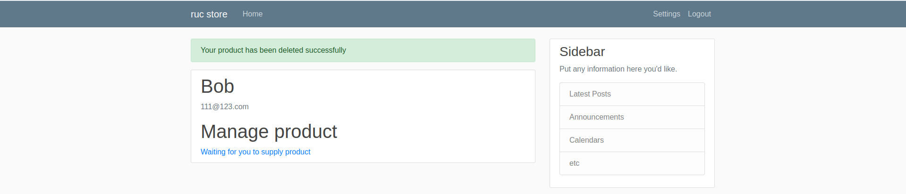

### 订单管理
* [route.py](../src/store/routes.py)
* [forms.py](../src/store/forms.py)
* [models.py](../src/store/models.py)
* [home.py](../src/store/templates/home.html)

#### Order table
我们并不是对一件商品的交易产生一条订单，而是对一次**清空购物车**(可能包含一件或多件商品的交易)产生一条订单。所以我们需要设计两个表，OrderDetail 负责记录某件商品的交易信息，Order 负责记录订单记录订单信息。OrderDetail 设置外键 product_id 关联到商品，外键 order_id 关联到订单。

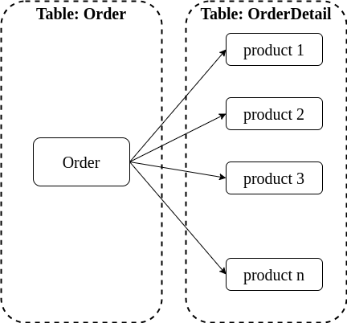

在实现的时候，可以近似地将顾客的购物车视作一个**未提交**的订单。当顾客向购物车中添加商品时，将商品交易添加到该订单中；当顾客从购物车中移出商品时，将商品交易从订单中移出；当顾客清空购物车时，将该订单提交。所以，我们不妨在 Order 订单表中增加 status 列以表示订单的状态(未提交、未发货、发货中、已完成)

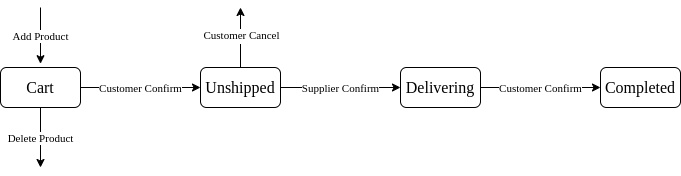

> 通过我们自己的定义，有一个简单地推论： **一个用户同一时间最多拥有一个未提交的订单**，即对应到购物车

```python
class OrderDetail(db.Model):
    __tablename__="OrderDetail"
    id = db.Column(db.Integer,primary_key=True)
    count = db.Column(db.Integer, nullable=False)
    order_id = db.Column(db.Integer,db.ForeignKey("Order.id"),nullable=False)
    product_id = db.Column(db.Integer, db.ForeignKey("Product.id"),nullable=False)


class Order(db.Model):
    __tablename__ = "Order"
    id = db.Column(db.Integer, primary_key=True)
    status = db.Column(db.Integer, nullable=False, default=0)
    start_time = db.Column(db.DateTime, nullable=False, default=datetime.utcnow)
    end_time = db.Column(db.DateTime, nullable=False, default=datetime.utcnow)
    total_price =db.Column(db.Float,nullable=False, default=0.00)
    customer_id = db.Column("customer_id", db.Integer,db.ForeignKey("Customer.id"),nullable=False)
    orderdetails = db.relationship("OrderDetail",backref="order",lazy=True)
```

#### 购物车
Customer 登录后即可在主界面看到商品信息(具体查看视图函数 `home` 和 [home.py](../src/store/templates/home.html) )

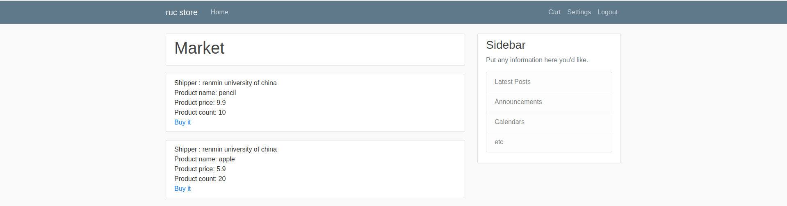

用户点击 Cart ( [layout.html](../src/store/templates/layout.html) 第 33 行)，跳转到 `shopping_cart`。正如之前所说，我们将购物车视作是一条未提交的订单，所以我们首先判断购物车对应的订单是否存在(通过用户名和状态可以唯一确定它)，不存在就创建一条，存在就列出所有商品并统计总价格。

```python
@app.route("/customer/cart")
@login_required
def shopping_cart():
    if current_user.table_name != "Customer":
        abort(403)
    customer = Customer.query.filter_by(id=current_user.table_id).first()
    if customer.consignee == "null" or customer.address == "null" or customer.telephone == "null":
        flash("Please complete your consignee information as soon as possible","warning")
        return redirect(url_for("customer_consignee_manage"))
    cart = Order.query.filter_by(customer_id=current_user.table_id, status=0).first()
    if cart is not None:
        orderdetails = OrderDetail.query.filter_by(order_id=cart.id).all()
        price = 0
        for orderdetail in orderdetails:
            product = Product.query.filter_by(id=orderdetail.product_id).first()
            price = price+orderdetail.count*product.price
        cart.total_price = price
        db.session.add(cart)
        db.session.commit()
        return render_template("shopping_cart.html", orderdetails=orderdetails,cart=cart)
    else:
        cart = Order(customer_id=current_user.table_id)
        db.session.add(cart)
        db.session.commit()
        orderdetails = None
        return render_template("shopping_cart.html", orderdetails=orderdetails,cart=cart)
```

在 [shopping_cart.html](../src/store/templates/shopping_cart.html) 文件中实现前端


购买商品通过主界面 `Buy it` 将商品首先添加到购物车中

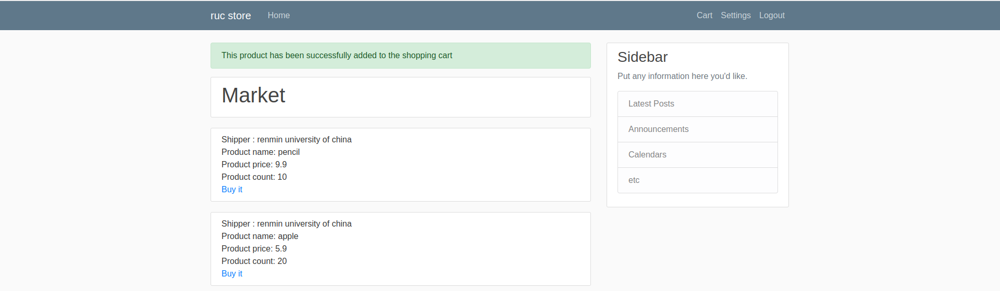

添加到购物车主要做两件事情：(1) 根据商品生成一条 OrderDetail 条目，包含购买数量(初始化 1)，商品 id 等；(2) 将商品与订单关联起来，实际上就是将生成条目的外键 order_id 设置为购物车对应的订单 id，如果不存在则首先生成 Order 条目。

注意我们定义不能在一条订单中添加相同商品的多条记录，所以我们还需要判断购物车中是否已经存在我们想要添加的商品。

```python
@app.route("/customer/product/add/<int:id>", methods=["POST","GET"])
@login_required
def add_product(id):
    if current_user.table_name != "Customer":
        abort(403)
    cart = Order.query.filter_by(customer_id=current_user.table_id, status=0).first()
    if cart:
        if OrderDetail.query.filter_by(order_id=cart.id, product_id=id).first() is None:
            order_detail = OrderDetail(count=1, order_id=cart.id, product_id=id)
            db.session.add(order_detail)
            db.session.commit()
            flash("This product has been successfully added to the shopping cart", "success")
            return redirect(url_for("home"))
        else:
            flash("This product is already in the shopping cart", "warning")
            return redirect(url_for("home"))
    else:
        cart = Order(customer_id=current_user.table_id)
        db.session.add(cart)
        db.session.commit()
        order_detail = OrderDetail(count=1, order_id=cart.id, product_id=id)
        db.session.add(order_detail)
        db.session.commit()
        flash("This product has been successfully added to the shopping cart", "success")
        return redirect(url_for("home"))
```

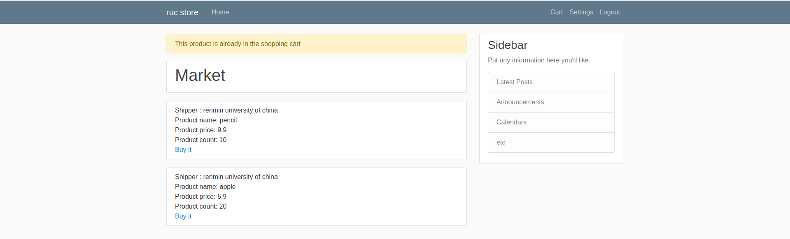

当我们向购物车中添加完合适的商品后，点击 header 的 Cart 导航，即可看到自己购物车的内容。

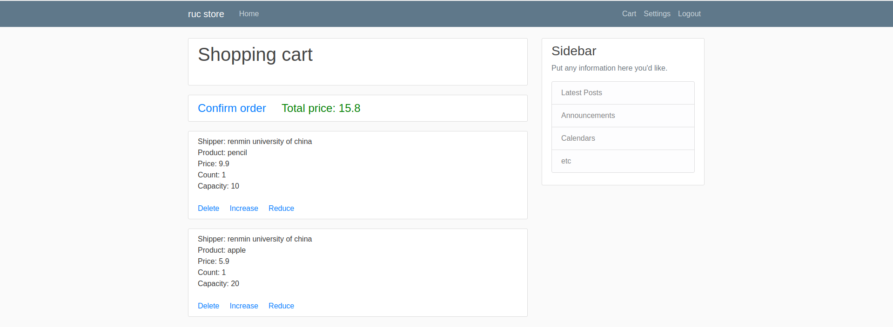

对于每个商品，我们还需提供增加数量、减少数量、删除商品的功能。这些功能都是对单表单条目的简单操作，只需要注意**商品数量理应在合适的范围内**

```python
@app.route("/customer/product/increase/<int:id>",methods=["POST","GET"])
@login_required
def add_by_1(id):
    if current_user.table_name != "Customer":
        abort(403)
    cart = Order.query.filter_by(customer_id=current_user.table_id, status="0").first()
    orderdetail = OrderDetail.query.filter_by(order_id=cart.id, product_id=id).first()
    condition = orderdetail.count+1<=Product.query.filter_by(id=id).first().count and orderdetail.count>0
    while condition:
        orderdetail.count = orderdetail.count+1
        db.session.add(orderdetail)
        db.session.commit()
        flash("Increase successfully", "success")
        break
    return redirect(url_for("shopping_cart"))
```


```python
@app.route("/customer/product/reduce/<int:id>",methods=["POST","GET"])
@login_required
def delete_by_1(id):
    if current_user.table_name != "Customer":
        abort(403)
    cart = Order.query.filter_by(customer_id=current_user.table_id, status="0").first()
    orderdetail = OrderDetail.query.filter_by(order_id=cart.id, product_id=id).first()
    condition = orderdetail.count<=Product.query.filter_by(id=id).first().count and orderdetail.count-1>0
    while condition:
        orderdetail.count = orderdetail.count-1
        db.session.add(orderdetail)
        db.session.commit()
        flash("Reduce successfully", "success")
        break
    return redirect(url_for("shopping_cart"))
```

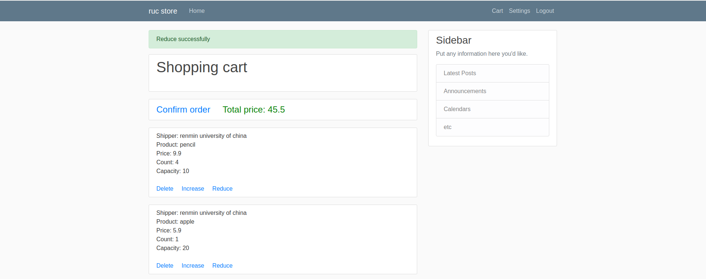

```python
@app.route("/customer/product/delete/<int:id>",methods=["POST","GET"])
@login_required
def delete_product_from_shopping_car(id):
    if current_user.table_name != "Customer":
        abort(403)
    cart = Order.query.filter_by(customer_id=current_user.table_id, status=0).first()
    orderdetail = OrderDetail.query.filter_by(order_id=cart.id, product_id=id).first()
    db.session.delete(orderdetail)
    db.session.commit()
    flash("Delete successfully", "success")
    return redirect(url_for("shopping_cart"))
```

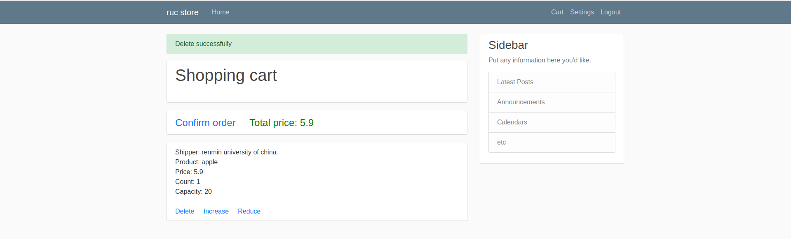

当我们点击 `Confirm order`，需要做两件事情： (1)减少购买的商品的剩余量； (2)更改订单状态并添加时间信息。当然，因为在我们将商品添加到购物车到确认的一段时间内，可能发生其他顾客购买商品或者供应商修改商品数量，所以我们还需要首先判断商品剩余量是否还能满足我们需求

```python
@app.route("/customer/confirm_order/<int:id>",methods=["POST","GET"])
@login_required
def confirm_order(id):
    if current_user.table_name != "Customer" or \
            Order.query.filter_by(id=id).first().customer_id!=current_user.table_id:
        abort(403)
    cart = Order.query.filter_by(id=id).first()
    for detail in cart.orderdetails:
        product = Product.query.filter_by(id=detail.product_id).first()
        if detail.count > product.count:
            if product.count > 0:
                flash("Insufficient supply","warning")
                detail.count = 1
                db.session.add(detail)
                db.session.commit()
                return redirect(url_for("shopping_cart"))
            else:
                flash("Insufficient supply", "warning")
                row = detail
                db.session.delete(row)
                db.session.commit()
                return redirect(url_for("shopping_cart"))
        else:
            product.count = product.count - detail.count
            db.session.add(product)
            db.session.commit()
    cart.status = 1
    cart.start_time = datetime.now()
    db.session.add(cart)
    db.session.commit()
    return redirect(url_for("shopping_cart"))
```

#### 订单


Customer 清空购物车确认订单后，该订单就需要交由 Supplier 确认发货。

> 注意: 我们当前支持**单供应商多顾客**，所以对于供应商来说，其可获得**所有用户**的**所有待发货订单**。

Supplier 点击 header 的 Settings，进入 `Manage orders` 即可看到自己需要处理的订单信息。 [route.py](../src/store/routes.py) 中视图函数 supplier_order_manage 查询所有需要供应商发货的商品。

```python
@app.route("/supplier/orders")
@login_required
def supplier_order_manage():
    if current_user.table_name != "Supplier":
        abort(403)
    unshipped_orders = Order.query.filter_by(status=1).all()
    return render_template("order_manage.html", unshipped_orders=unshipped_orders)
```

在 [order_manager.html](../src/store/templates/order_manage.html) 中实现前端

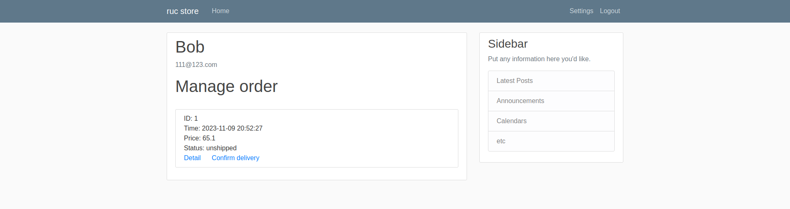

点击确认发货则只需要修改订单状态即可

```python
@app.route("/supplier/orders/confirm_delive/<int:id>")
@login_required
def confirm_deliver_order(id):
    if current_user.table_name != "Supplier":
        abort(403)
    order = Order.query.filter_by(id=id).first()
    order.status = 2
    db.session.add(order)
    db.session.commit()
    flash("Order shipped successfully","success")
    return redirect(url_for("supplier_order_manage"))
```

Customer 点击 header 的 Settings，进入 `Manage orders` 即可看到自己所有的订单信息。

```python
@app.route("/customer/orders")
@login_required
def customer_order_manage():
    if current_user.table_name != "Customer":
        abort(403)
    unshipped_orders = Order.query.filter_by(customer_id=current_user.table_id,status=1).all()
    delivering_orders = Order.query.filter_by(customer_id=current_user.table_id, status=2).all()
    completed_orders = Order.query.filter_by(customer_id=current_user.table_id, status=3).all()
    return render_template("order_manage.html", unshipped_orders=unshipped_orders,delivering_orders=delivering_orders,completed_orders=completed_orders)

```

在 [order_manage.html](../src/store/templates/order_manage.html) 中实现前端

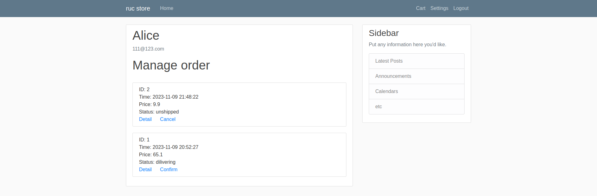

对于还未发货的订单，我们可以点击 Cancel 取消。实现的时候，注意需要**恢复商品原来的剩余量**

```python
@app.route("/customer/order/cancel/<int:id>")
@login_required
def cancel_order(id):
    order =Order.query.filter_by(id=id).first()
    if current_user.table_name != "Customer" or order.customer_id != current_user.table_id:
        abort(403)
    if order.status != 1:
        flash("The order has been shipped","danger")
        return redirect(url_for("customer_order_manage"))
    else:
        details = order.orderdetails
        for detail in details:
            product = Product.query.filter_by(id=detail.product_id).first()
            product.count = product.count + detail.count
            db.session.add(product)
            db.session.commit()
            db.session.delete(detail)
            db.session.commit()
        db.session.delete(order)
        db.session.commit()
        flash("Your order has been canceled successful!","success")
        return redirect(url_for("customer_order_manage"))
```

对于在运输中商品，点击 Confirm 收货。实现只需要修改订单状态和完成时间

```python
@app.route("/customer/order/confirm/<int:id>")
@login_required
def customer_confirm_order(id):
    if current_user.table_name != "Customer":
        abort(403)
    order = Order.query.filter_by(id=id).first()
    order.status = 3
    order.end_time = datetime.now()
    db.session.add(order)
    db.session.commit()
    flash("You have confirmed the order", "success")
    return redirect(url_for("customer_order_manage"))
```

对于 Customer 和 Supplier 来说，他们都可以点击订单列表的 Detail 查看订单详情

```python
@app.route("/order/<int:id>")
@login_required
def show_order_details(id):
    if current_user.table_name == "Customer":
        if Order.query.filter_by(id=id).first().customer_id != current_user.table_id:
            abort(403)
    order = Order.query.filter_by(id=id).first()
    address = order.customer
    details = order.orderdetails
    return render_template("show_order_details.html",order=order,address=address,details=details)
```

在 [show_order_detail.html](../src/store/templates/show_order_details.html) 文件中实现前端

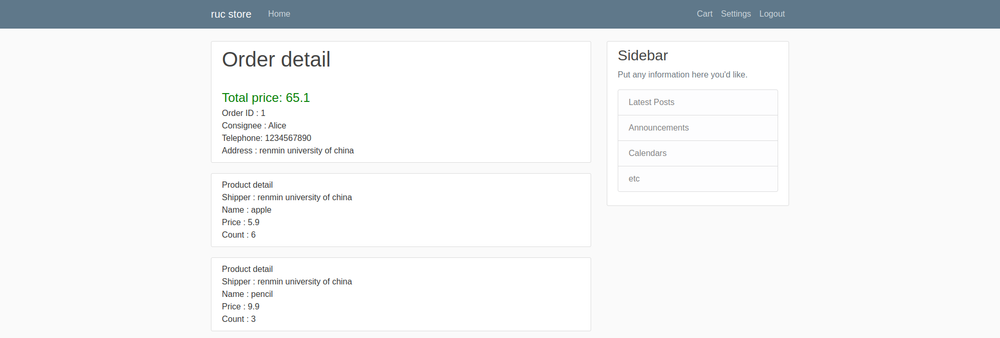

## 如何扩展实现本项目
本项目相比于现在成熟的购物系统，还有很多很多不足，同学们可以结合实际情况丰富功能或者重构项目。这里提供一些思路抛砖引玉
* 支持多供应商
* 支持顾客添加多个收货地址
* 增加新角色 “打工人”
* 支持存在订单的商品下架
* 丰富商品信息，增加图片、类别等
* 商品推荐系统
* ……